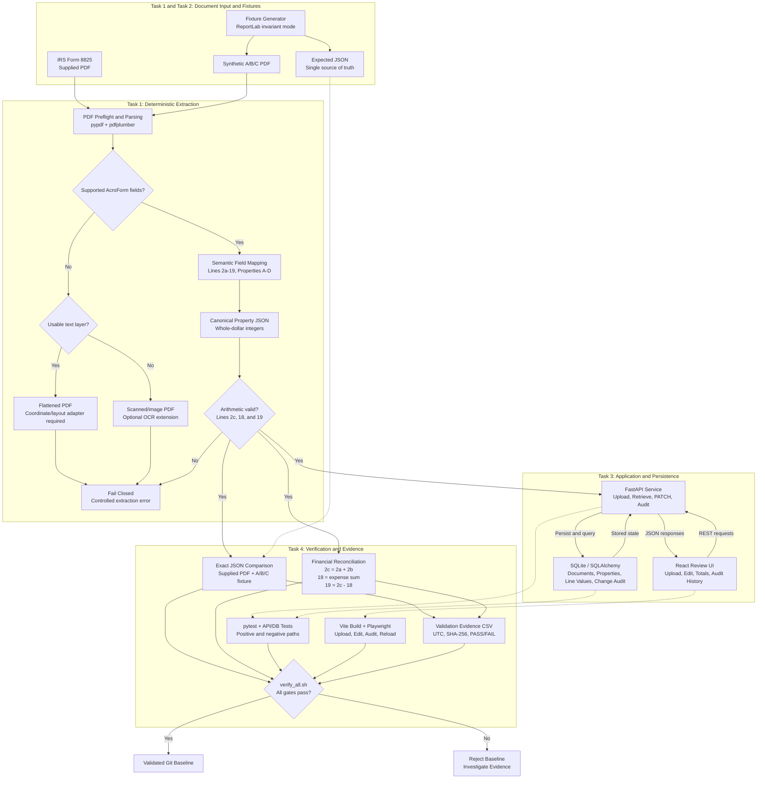
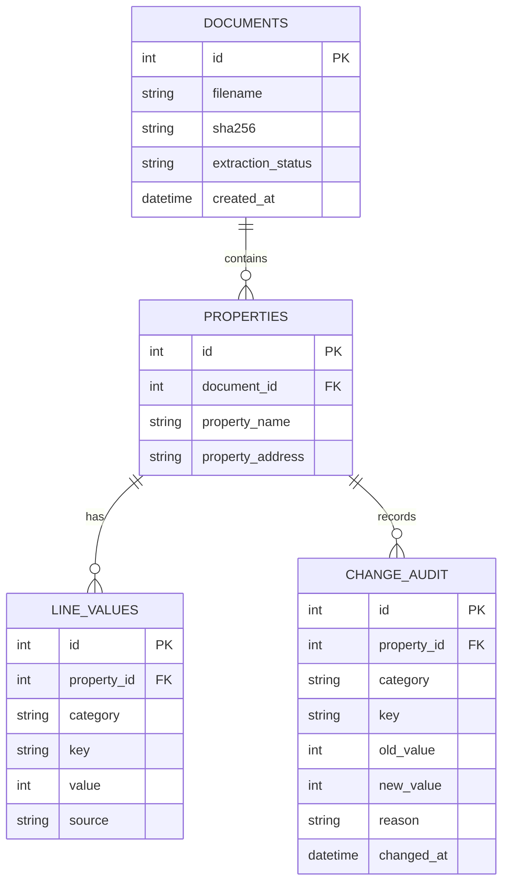

# Form 8825 Solution Architecture

## 1. Scope

This repository implements the four tasks around IRS Form 8825:

1. extract property income/expense values from the supplied PDF;
2. generate and validate a deterministic multi-property A/B/C fixture;
3. persist extraction results behind FastAPI/SQLite and review/edit them from React;
4. verify JSON correctness, line 2c/18/19 arithmetic, grand-total net income, API/database behavior, and UI behavior.

The architecture is intentionally deterministic. AI may accelerate implementation and test design, but extraction acceptance is controlled by explicit field mappings, exact expected JSON, arithmetic invariants, database provenance, and automated tests.

## 2. End-to-end architecture

The complete solution separates document acquisition, deterministic extraction, financial validation, persistence/review, and independent verification.



**Architecture principle:** PDF acquisition and field interpretation are separated from canonical financial validation. FastAPI owns server-side recalculation and audit persistence, while React provides the human review surface. An independent verification pipeline checks extraction accuracy, financial invariants, database provenance, and browser behavior before the Git baseline is accepted.

The flattened-text and scanned-PDF branches are intentionally represented as extension paths. The current baseline fails closed rather than silently accepting unsupported extraction paths.

## 3. Extraction hierarchy

### 3.1 AcroForm first

The supplied December 2025 Form 8825 contains AcroForm values. `pypdf.PdfReader.get_fields()` is therefore the highest-confidence extraction path. Values are mapped to a canonical schema instead of reconstructing the visual table with OCR.

Supported field layouts:

- the supplied IRS page-1 A-D field pattern (`Line2a`, `Line18`, etc. plus adjacent numeric field identifiers);
- the synthetic fixture's canonical names, for example `property.A.line2a`.

### 3.2 Text-layer probe

`usable_text_layer()` uses `pdfplumber`, removes whitespace, and counts extractable text per page. A PDF is considered text-usable when at least 50% of pages contain at least 80 non-whitespace characters. This reduces false positives from image PDFs that contain only tiny hidden text fragments.

### 3.3 Flattened text and scanned input

The baseline intentionally fails closed if a PDF has no supported AcroForm structure. If substantial text exists, the error identifies the missing flattened-coordinate implementation. If substantial text does not exist, the error identifies likely scanned/image-only input.

The optional scanned path is documented in [`PDF-Failure-Modes.md`](PDF-Failure-Modes.md) and uses page rendering + OCR + bounding boxes + confidence + version-specific cell geometry before feeding the same canonical validation layer.

## 4. Canonical property schema

```json
{
  "property_name": "A",
  "property_address": "...",
  "income_line_items": {
    "gross_rents": 0,
    "other_income": 0
  },
  "expense_line_items": {
    "advertising": 0,
    "auto_travel": 0,
    "cleaning_maintenance": 0,
    "commissions": 0,
    "insurance": 0,
    "interest": 0,
    "legal_professional": 0,
    "real_estate_taxes": 0,
    "repairs": 0,
    "utilities": 0,
    "wages_salaries": 0,
    "depreciation": 0,
    "other_deductions": 0
  },
  "totals": {
    "total_rental_income": 0,
    "total_expenses": 0,
    "net_income": 0
  }
}
```

Money is represented as whole-dollar integers to avoid floating-point accounting drift.

## 5. Arithmetic invariants

For every property:

```text
line 2c = line 2a + line 2b
line 18 = sum(expense line items 3-17 represented by the schema)
line 19 = line 2c - line 18
```

For the multi-property fixture:

```text
Grand total net income = sum(property line 19 values)
                       = 153,900
```

Extraction fails if a populated PDF does not reconcile.

## 6. Synthetic A/B/C fixture

`scripts/generate_multi_property_pdf.py` defines one source data structure and derives both:

- `data/f8825_multi_ABC.pdf`
- `data/f8825_multi_ABC_expected.json`

This prevents fixture drift caused by separately hand-maintaining a PDF and expected output.

Expected totals:

| Property | line 2c | line 18 | line 19 |
|---|---:|---:|---:|
| A | 125,000 | 89,000 | 36,000 |
| B | 212,500 | 154,200 | 58,300 |
| C | 182,500 | 122,900 | 59,600 |
| Grand net |  |  | 153,900 |

## 7. API architecture

The API exposes:

- `GET /health`
- `POST /documents`
- `GET /documents/{document_id}`
- `PATCH /properties/{property_id}/value`
- `GET /properties/{property_id}/audit`

Key controls:

- live verification is gated on bounded `GET /health` readiness before API/DB assertions run;
- upload-size limit (`MAX_UPLOAD_BYTES`, default 20 MiB);
- `%PDF-` magic-header check;
- extraction failures returned as HTTP 422;
- totals cannot be manually patched;
- totals are recalculated server-side after source-value edits;
- every source-value edit creates an audit record;
- SQLAlchemy transactions roll back on persistence errors;
- CORS is limited to the local Vite origins used by the demo.

See [`API.md`](API.md).

## 8. Database architecture

The persistence model separates uploaded-document identity, property identity, financial line values, calculated totals, provenance, and manual-edit audit history.



### Database relationship behavior

```text
documents
    |
    | 1 : many
    v
properties
    |
    +---- 1 : many ----> line_values
    |
    +---- 1 : many ----> change_audit
```

A document can therefore contain multiple Form 8825 properties:

```text
Document 1
 |- Property A
 |- Property B
 `- Property C
```

Each property owns its financial values:

```text
Property A
 |- income_line_items.gross_rents
 |- income_line_items.other_income
 |- expense_line_items.advertising
 |- ...
 |- totals.total_rental_income
 |- totals.total_expenses
 `- totals.net_income
```

and independently owns its edit history:

```text
Property A
 `- gross_rents
      120000
         |
         | manual correction
         v
      121000
         |
         +-- line_values.source = "manual"
         |
         `-- change_audit
              old_value = 120000
              new_value = 121000
              reason    = ...
```

The corresponding totals are then recalculated by the backend:

```text
gross_rents 120000 -> 121000
                 |
                 v
total_rental_income 125000 -> 126000
total_expenses                89000
net_income           36000 -> 37000
```

The updated calculated values have:

```text
line_values.source = "calculated"
```

rather than `manual`.

### Provenance model

`line_values.source` has three intended states:

| Source | Meaning |
|---|---|
| `extracted` | Value came directly from the PDF extraction result |
| `manual` | Reviewer changed a source financial value |
| `calculated` | Backend recalculated the value from other source values |

This makes the database distinguish:

```text
what the PDF said
```

from:

```text
what a reviewer corrected
```

and:

```text
what the application mathematically derived
```

### Integrity controls

Database-level controls include:

- foreign-key enforcement enabled explicitly for SQLite;
- one property identity per document/property name;
- one semantic line value per property/category/key;
- audit records associated with the property being changed;
- calculated totals protected from direct UI/API modification;
- transaction rollback when persistence fails.

The key uniqueness contracts are conceptually:

```text
UNIQUE(document_id, property_name)
```

and:

```text
UNIQUE(property_id, category, key)
```

These prevent duplicate property rows and duplicate financial semantic keys.

See [`Database.md`](Database.md) for the persistence model and validation details.

## 9. React architecture

The React UI:

- uploads a PDF;
- renders A/B/C property cards;
- edits source line values only;
- saves on blur/Enter rather than issuing PATCH requests on every keystroke;
- renders server-recalculated totals with stable test IDs;
- displays audit history;
- stores the last document ID in local storage and reloads it via `GET /documents/{id}` after a browser refresh.

This makes persistence observable in the E2E test.

## 10. Validation architecture

Validation is layered:

```text
static/runtime preflight
        |
        v
fixture regeneration
        |
        v
extract real + synthetic PDFs
        |
        v
exact JSON comparison
        |
        v
pytest extraction/API/negative tests
        |
        v
CSV evidence generation
        |
        v
API + SQLite verification script
        |
        v
Vite production build
        |
        v
Playwright end-to-end UI test
```

Use `scripts/verify_all.sh` for the final gate. Detailed commands and expected results are in [`Validation.md`](Validation.md).
